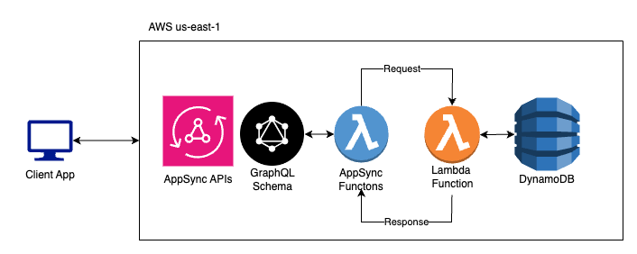

# eCommerce Product Microservice

A high-performance microservice for managing product information in an AWS-hosted eCommerce application. This service handles product data management through AWS Lambda functions and GraphQL APIs.

## Architecture Overview



## Prerequisites

- Node.js 18.x or higher
- AWS Account with appropriate permissions
- AWS CLI configured locally
- AWS SAM CLI installed
- Docker (for local testing)

## Data Models

### Products Table

**Table Name:** Products

| Attribute    | Type      | Description                    |
|-------------|-----------|--------------------------------|
| productId   | String    | Unique identifier (Partition Key) |
| name        | String    | Product name                   |
| description | String    | Product description            |
| price       | Number    | Product price                  |
| category    | String    | Product category               |
| stock       | Number    | Available inventory            |
| createdAt   | Timestamp | Creation timestamp             |
| updatedAt   | Timestamp | Last update timestamp          |

### Product Taxonomy Table

**Table Name:** ProductTaxonomyAttributes

| Attribute    | Type   | Description                     |
|-------------|--------|---------------------------------|
| taxonomyId  | String | Unique identifier (Partition Key)|
| name        | String | Category/tag name               |
| description | String | Category/tag description        |
| parentId    | String | Parent category identifier      |
| type        | String | Taxonomy type (category/tag)    |

## API Endpoints

### GraphQL Schema

```graphql
schema {
    query: Query
    mutation: Mutation
}

type Product {
    productId: String!
    name: String!
    description: String!
    category: ProductTaxonomy!
    price: Int!
    stock: Int!
    createdAt: AWSDateTime
    updatedAt: AWSDateTime
}

type ProductTaxonomy {
    taxonomyId: String!
    name: String!
    description: String!
    parentId: String!
    type: String!
    createdAt: AWSDateTime
    updatedAt: AWSDateTime
}

type Error {
    message: String!
    code: String!
    type: String!
}

type ProductResponse {
    data: Product
    error: Error
}

type ProducTaxonomyResponse {
    data: ProductTaxonomy
    error: Error
}

type ProductListResponse {
    data: [Product]
    error: Error
}

type Query {
    getProduct(productId: String!): ProductResponse!
    getProductsByCategory(taxonomyId: String!): ProductListResponse!
    getProductTaxonomy(taxonomyId: String!): ProducTaxonomyResponse!
}

input ProductInput {
    name: String!
    description: String!
    price: Int!
    category: String!
    stock: String!
}

input ProductTaxonomyInput {
    name: String!
    description: String!
    parentId: String
    type: String!
}

type IdResponse {
    id: String
}

type IdResponseError {
    data: IdResponse
    error: Error
}

type Mutation {
    addProduct(
        name: String!
        description: String!
        price: Int!
        category: String!
        stock: Int!
    ): IdResponseError!
    updateProduct(
        productId: String!
        name: String!
        description: String!
        price: Int!
        category: String!
        stock: Int!
    ): ProductResponse!
    deleteProduct(productId: String): IdResponseError!
    addProductTaxonomy(
        name: String!
        description: String!
        parentId: String
        type: String!
    ): IdResponseError!
    updateProductTaxonomy(
        taxonomyId: String!
        name: String!
        description: String!
        parentId: String
        type: String!
    ): ProducTaxonomyResponse!
    deleteProductTaxonomy(taxonomyId: String): IdResponseError!
}
```

## Project Structure

```
.
├── gql/
│   ├── product.js
│   ├── productTaxonomy.js
│   ├── schema.graphql
├── product/
│   ├── tests/
│   ├── handlers/
│   │   ├── products/
│   │   └── taxonomy/
│   ├── package.json
│   └── app.mjs
├── tests/
├── template.yaml
├── samconfig.toml
└── buildspec.yml
```

## Setup and Deployment

1. Clone the repository:
```bash
git clone https://github.com/ratndeep007/expedite_commerce_task.git
cd expedite_commerce_task
```

2. Install dependencies:
```bash
cd product/
npm install
```

3. Deploy using SAM:

From root of project run:
```bash
sam build
sam deploy --guided
```

## CI/CD Pipeline

The project uses AWS CodePipeline with the following stages:

1. **Source**: Code is pulled from CodeCommit/GitHub
2. **Build and Deploy**:
   - Runs unit tests
   - Runs `sam build`
   - Runs `sam deploy`


### Pipeline Configuration

Pipeline is defined in `buildspec.yml`:

```yaml
version: 0.2
phases:
  install:
    runtime-versions:
      nodejs: 20
    commands:
      - echo Installing dependencies...
      - cd product && npm install
  build:
    commands:
      - echo Running tests...
      - npm test
      - cd ..
      - echo Building the application...
      - sam build
      - echo Deploying the application...
      - sam deploy --no-confirm-changeset --no-fail-on-empty-changeset
```
